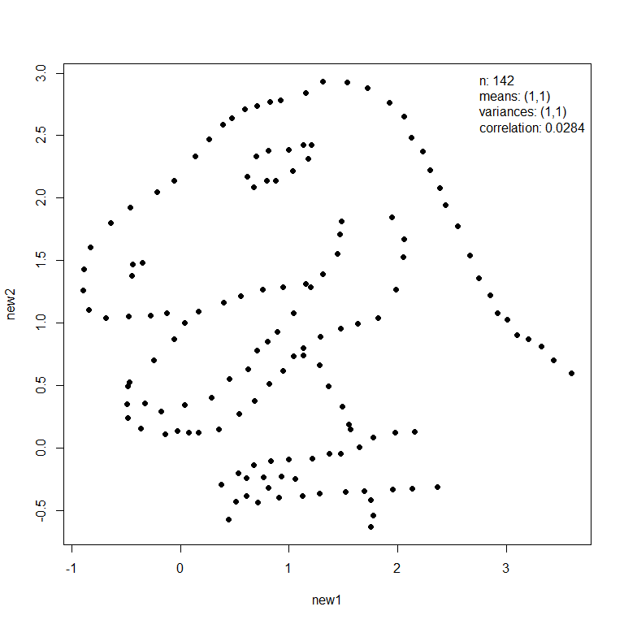
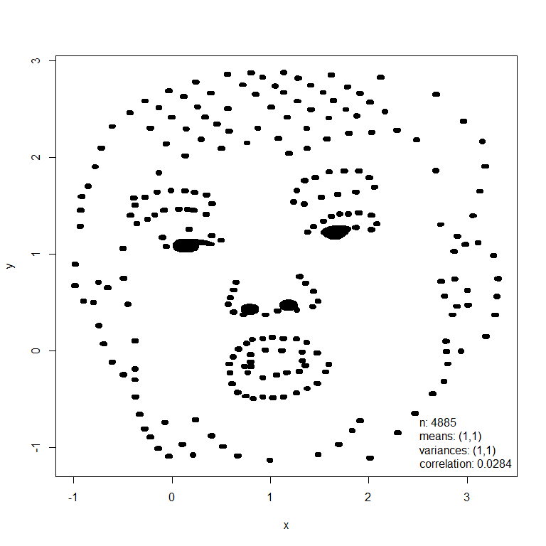

<!-- README.md is generated from README.Rmd. Please edit that file -->

# anscombiser <a href="https://paulnorthrop.github.io/anscombiser/"></a>

[](https://github.com/paulnorthrop/anscombiser/actions/workflows/R-CMD-check.yaml)
[](https://codecov.io/github/paulnorthrop/anscombiser?branch=master)
[](https://cran.r-project.org/package=anscombiser)
[](https://cran.r-project.org/package=anscombiser)
[](https://cran.r-project.org/package=anscombiser)

### What does anscombiser do?

Anscombe’s quartet are a set of four two-variable datasets that have
several common summary statistics (essentially means, variances and
correlation) but which have very different joint distributions. This
becomes apparent when the data are plotted, which illustrates the
importance of using graphical displays in Statistics. The `anscombiser`
package provides a quick and easy way to create several datasets that
have common values for Anscombe’s summary statistics but display very
different behaviour when plotted. It does this by transforming
(shifting, scaling and rotating) the dataset to achieve target summary
statistics.

### An example

The `mimic()` function transforms an input dataset (`dino` below left)
so that it has the same values of Anscombe’s summary statistics as
another dataset (`trump` below right).

``` r
library(anscombiser)
library(datasauRus)
dino <- datasaurus_dozen_wide[, c("dino_x", "dino_y")]
new_dino <- mimic(dino, trump)
plot(new_dino, legend_args = list(x = "topright"))
plot(new_dino, input = TRUE, legend_args = list(x = "bottomright"), pch = 20)
```



In this example these images had similar summary statistics from the
outset and therefore the appearance of the `dino` dataset has changed
little. Otherwise, the first dataset will be deformed but its general
shape will still be recognisable.

The rotation applied to the input dataset is not unique. The function
`mimic` (and a function `anscombise` that is specific to Anscombe’s
quartet) has an argument `idempotent` that controls how the rotation is
performed. In the special case where the input dataset already has the
desired summary statistics, using `idempotent = TRUE` ensures that the
output dataset is the same as the input dataset.

### Installation

To get the current released version from CRAN:

``` r
install.packages("anscombiser")
```

### Vignette

See `vignette("intro-to-anscombiser", package = "anscombiser")` for an
overview of the package.
